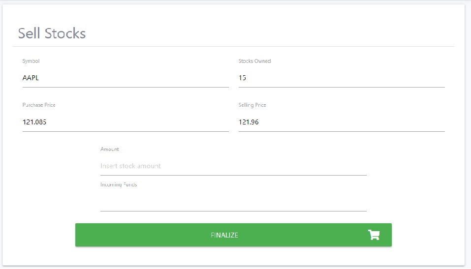

# My Broker

"My broker" is a broker created for educational purposes only, where the user can practice its investment and analytical skills 
by purchasing and selling stocks without having to use real money. This broker only gives the option of purchase or selling the stocks, any analysis has to be done on another application.

When the user registers an account, $10,000 becomes available to buy stocks. Once the stocks are bought they will be displayed on its profile
and on the "Open Positions" page. The profile page displays an overview of the account with the funds available, the current profit or loss amount coming from the open positions which are also displayed on this page.
When it's time to sell, the user can sell the total amount of stock owned or just part of it. 
The stocks sold are then displayed on the "Closed Position" page with the relevant details. If a bad investment is done and the user runs out of available funds
there's an option to top up the account with an extra $10,000.

The market prices are provided by an API however due to limitation of their free service, only one stock is available. Besides this, the prices available have a delay of one day, in other words, today the user will be buying 
Apple stock for yesterday's closing price. If the user is operating on Monday, the application will work on Friday's prices.

A live demo of website can be found [here](https://my-broker.herokuapp.com/).

## UX

The main users of this application will be people who want to test their investment and analytical without the risk of using their own money for it. 

The navigation is very user friendly, starting with an index page where a brief explanation is given and two buttons are displayed, one to register and another one to log in.


Once the registration or log in is done, the user is redirected to his profile page where an overview of his account is displayed. On the left side there's a navigation bar with links to
the dashboard, or profile page, open positions, closed positions and the stocks available on the market.

### User Stories

- As a aspiring investor, I want to buy stocks, in order to test my investment and analytical skills.
- As a aspiring investor, I want to sell stocks, in order to test my investment and analytical skills, avoid more loss and take the profits.
- As a aspiring investor, I want to be able to sell all my stocks owned, avoid more loss and take the profits.
- As a aspiring investor, I want to be able to sell part of the stocks owned, to take some of the available profit but keep some of the stocks.
- As a aspiring investor, I want to have access to all my current owned stocks, or open positions, in order to decide on what to do with them.
- As a aspiring investor, I want to have access to all sold stocks, or closed positions, in order to see my history.
- As a aspiring investor, I want to have access to the stocks available in the market with their opening, highest, lowest and closing prices, in order to make a informed decision on my investment.
- As a aspiring investor, I want to see how much funds I have available, in order to make a informed decision on my investment.

### Strategy

The goal of this project is to give the user a as real as possible experience of what making these type of investments are all about. Recent events attracted a lot of people, including minors, to invest in stocks
using any of the available platforms online without taking into consideration the possible outcomes of a bad investment. People shouldn't be affraid of making investments, they are good for the economy, but 
more financial education should be given to everyone before starting. This application is a good start for beginners that want to take steps into the trading and investment world.

### Scope

This appliacation was built with the goal of simplifying the process of investing on stocks to give a beginner investor and oportunity to practice risk free.

### Wireframes

* Home


* Profile


* Open/Closed Positions


* Purchase Stocks


* Selling Stocks


### Surface

The palette of colors chosen was based on solely personal taste.

## Database Architecture

### Schema

The database is divided into 4 collections:
- user
- transactions
- closed_positions
- wallet_transactions

"Users" collections is where the first and last names along with username and salted password are stored.
In the "transaction" collection there's all the purchased stocks, in other words, the open positions. The user has access to this data on the profile page and on the "Open Positions" page. 
Data is created into this collections when the user buys stocks, it is updated when the user sells less stocks than the amount owned and is deleted when the user sells the total amoun of stocks owned.
Whenever the user sells stocks, regardless of the amount, a new entry is created in collection "closed_positions" to store history. This way the user can access previous actions.
Finally, every purchase or selling creates an entry on collection "wallet_transaction" so that the total available funds can be calculated and displayed at any time.

Bellow is the graphical representation of my database schema:


## Existing Features

<ins>Feature 1</ins><br>
- As a aspiring investor, I want to buy stocks, in order to test my investment and analytical skills.


<ins>Feature 2</ins><br>
- As a aspiring investor, I want to sell stocks, in order to test my investment and analytical skills, avoid more loss and take the profits.
- As a aspiring investor, I want to be able to sell all my stocks owned, avoid more loss and take the profits.
- As a aspiring investor, I want to be able to sell part of the stocks owned, to take some of the available profit but keep some of the stocks.

In this menu the user can insert the amount of stocks to be sold. 



<ins>Feature 3</ins><br>
- As a aspiring investor, I want to have access to all my current owned stocks, or open positions, in order to decide on what to do with them.


<ins>Feature 4</ins><br>
- As a aspiring investor, I want to have access to all sold stocks, or closed positions, in order to see my history.


<ins>Feature 5</ins><br>
- As a aspiring investor, I want to have access to the stocks available in the market with their opening, highest, lowest and closing prices, in order to make a informed decision on my investment.


<ins>Feature 6</ins><br>
- As a aspiring investor, I want to see how much funds I have available, in order to make a informed decision on my investment.


### Features Left to Implement

Would like to have more stocks available but that is dependent on a paid subscription on Alpoha Advantage API.
Features that aloow the user to make a basic technical analysis on the stock with a graph and some indicators.
Features that aloow the user to make a basic fundamental analysis on the stock with relevant news on the stock.

# Technologies Used

- Programming Languages
    - HTML
    - CSS
    - JavaScript
    - Python
- [Flask](https://flask.palletsprojects.com/en/1.1.x/)
    - Jinja toolkit
    - Werkzeug toolkit
- [PyMongo](https://fontawesome.com/)
    - Used to access MongoDB
- [MongoDB](https://www.mongodb.com/3)
    - MongoDb was the database used to store all the transactions and users
- [Alpha Advantage API](https://www.alphavantage.co/)
    - API used to acccess stock prices
- [jQuery v3.5.1](https://code.jquery.com/)
    - Used to simplify DOM manipulation
- [Google Fonts](https://fonts.google.com/)
    - Merriweather font style was used
- [Start Bootstrap](https://startbootstrap.com/)
    - Used the free templates as a starting point
- [Font Awesome](https://fontawesome.com/)

# Testing

All the tests done to this website can be found in testing.md.

# Deployment

## MongoDB

1.  After login in to [MongoDB](https://account.mongodb.com/), click on the Cluster's link under "Data Storage" on the left of the screen.
    On the cluster's overview clicked on "Connect".


2.  MongoDb provides three ways to connect with. I chose the second option which is to connect the application.


3.  From the next screen, after selecting "Python" as Driver and "3.6 or later" version, I copied the link provided and changed the <username> and <password>.
    For security this link was saved on the project's env.py.


4.  Finally I instanced PyMongo and passed the application.

```
mongo=PyMongo(app)
```

## Heroku

1.  The first thing was to create a requirements.txt and a Procfile as below:

```
pip3 freeze --local > requirements.txt
echo web: python app.py > Procfile
```

2.  Once these files were sucessfuly created I navigated to [Heroku](https://www.heroku.com/) and logged into my account.
    On the top right side of the screen click on "New" and created a new app.
  
  

3.  Then I had to chose a name for my app, I decided on "my_broker".
  
 

4.  After creating the app, I had to connect it with my Github account. In the app's page, navigated to "Deploy" and chose GitHub as my "Deployment Method".
    In this menu I had to insert the name of my repo on gitHub

 

Once connected to my GitHub, Heroku will confirm the app is connected to the repo.

 

5.  Next step is to conif the environmental variables used on the app. For that I navigated to "Settings" and clicked on "Reveal Config Vars"

 

6.  Now that everything was ready to deploy I navigated back to the "Deploy" page, disabled any automatic deploys and selected the master branch before clicking on "Deploy Branch".

 