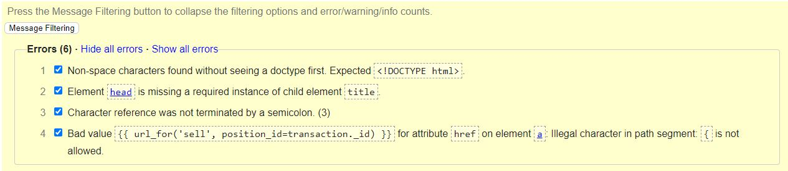

# My Broker - Testing Details

[Main README.md file](README.md)

[Github repository](https://github.com/Claudio-C-Santos/MS3-My-Broker)

## Code Validation

- [W3C HTML Validation Service](https://validator.w3.org/)

All HTML files were validated via Jigsaw's validation service and the only errors found were due the fact I used templates.
Bellow is a screenshot of one of the tests.

- [W3 CSS Validation Service](https://jigsaw.w3.org/css-validator/)

The style.css file was validated via Jigsaw's validation service and it showed no errors were found being certified by the icon below.

    

- [JSHint](https://jshint.com/)

All JavaScript files were validated no errors were found.

- [PEP8 Online](http://pep8online.com/)

Python has been validated and no signifcant errors were found besides minor indentation issues with lines which
were too long and had to be separated into separate lines.

## Testing User Stories from UX section of README.md

For these tests please remit to "Features" section on [README.md](README.md). In that section, there are screenshots with demonstrations on how to use each feature.

## Manual testing of all elements and functionalities throughout the Website

The app has been tested by friends and family who opened the app on different screen sizes like mobile phones, tablets and laptops. The tests were done using Chrome, Firefox and Edge.

## Application Testing

1.  All the pages are responsive according to the screen they are being viewed on.

2.  Registration Page:
    - The user can create its own account by inserting their first and last names along wiht a username and password.
    - If the user uses a username which has already been created, a error message is displayed notifying the user.
    - It doesn't allow the user to creatd usernames or passwords smaller than 5 characters in length.
    - When the "Register" button is clicked, an entry is created on "users" collection on MongoDB.
    - Once the registrating is successful, the user is redirected to his profile page.

3.  Login Page:
    - If the user inserts a wrong username or password a notification is displayed on the same page. 
    - The authentication process occurs successfuly.
    - Once the login is successful, the user is redirected to his profile page.

4.  Navigation bars (top and left side)
    - The top navigation bar displays correctly the available funds and the amount fo profit or loss.
    - All the links on the left side bar work.
    - The user's username is displayed on the top of the left bar.

5.  Profile Page
    - The correct amount of available funds is displayed. The characters turn red when the available funds are negative.
    - The "Add funds" link works well.
    - The correct amount of profit or loss is displayed colored in green for profit and red for loss.
    - A list of the open positions is displayed along with each position's profit/loss amount.

6.  Navigate to Stocks:
    - The prices are displayed correctly.
    - A "buy" button is displayed and successfuly directs the user to the "Purchase stock" page. In this page, the symbol and closing price is correctly displayed and the only field available for the user if the "Amount".
    Once the user inserts the amount of stock it pretends to purchase, the total cost will automatically display on the "Necessary Funds" field.
    - Once the user finalizes the purchase, he is redirected to the "Stocks" page where a message is displayed notifying the purchase is complete.
    - If the user tries to purchase more stocks than the available funds, an error message is displayed and nothing happens.

7.  Navigate to Open Positions:
    - All of the open positions are correctly displayed. The user only has access to the positions created by him and the relevant details are dispalyed on this screen.
    - A red "Sell" button os displayed with each open position.
    - When the button is clicked, the user is successfuly directed to a selling page along with the position's Object Id associated.
    - Just like when the user wants to purchase, on this screen the only available field is the amount which will trigger the calculation of the total "Incoming Funds"
    - If the user chooses to sell all the owned stock, it correctly deletes that entry from the collection.
    - If the user chooses to sell a smaller amount that the one onwed, the collection is correctly updated with the remaining amount of stock.
    - On both options, an entry is created on the Closed_Positions collections to display on the related page.
    - If the user tries to sell more stocks than owned, a error message is displayed and nothing happens.

8.  On the top right corner, there's a Logout button that works correctly by deleting the user's session and directing him to thje login page. A message confirming the logout is displayed.